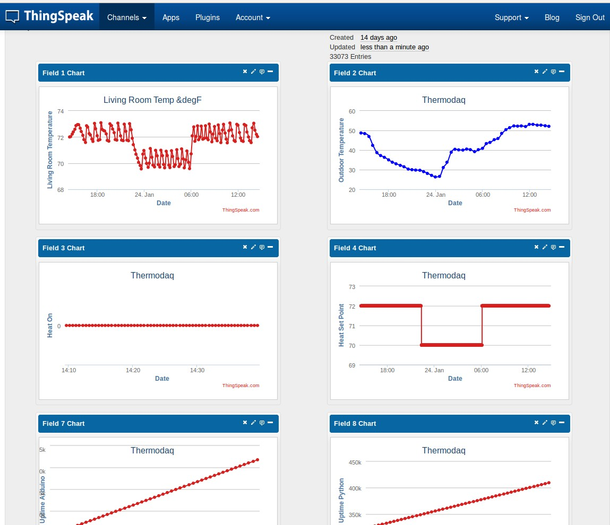

# Thingspeak Integration

## What is Thingspeak.com?

[Thingspeak](thingspeak.com) is really, really cool. Check the out.

For this project they serve two purposes:

1. They collect data from the thermostat for long term data storage.
1. They store the most recent "home/away" status.

## DAQ

If you have an Internet enabled thermostat, don't you want to know how it's
doing? Don't you want to know what it did last summer?

Thingspeak is a convenient way for the python script to record it's vital
statistics for future retreival. Why would you want that? Well, I've seen some
clever ideas, such as:

 * Plotting the amount of time the thermostat has been running each month.
 * Compare the % on time against the difference in outdoor temperature and the set point
 * Determine how many hours of furnace time you've saved since you installed the
   YunThermostat.
   
We don't have any of these tools written yet, but you can't do any of them
without the records.

## Screenshots

A glance of the most recent data in the daq.

## Set up

1. Visit Thingspeak.com. Sign up. Make a new channel just for your YunThermostat.
1. Select API Keys, and find your "Write API Key".
1. Go to your configuration page (the gear in the top-right of the web page) and
expand the "ThingSpeak" section.
1. Enable Thingspeak if you haven't already.
1. Add the Write API key to the API key for the DAQ channel.

You don't have to restart anything, just save the settings by clicking the
checkmark in the top left. The app will start recording in less than a minute.

## Set up Linux Processor Statistics.

There are some [instructions](http://community.thingspeak.com/2014/05/official-tutorial-monitoring-linux-server-statistics/)
on Thingspeak.com for recording server statistics. We've modified the script to
work on the Yun (or any OpenWRT, AFAIK).

The script is in the github repo at: 
[linux/scripts/server_stats.sh](https://github.com/jeffeb3/YunThermostat/blob/master/linux/scripts/server_stats.sh)

Follow the instructions on thingspeak, but use the script from the YunThermostat instead.

## Set up Away/Home Status

TODO
