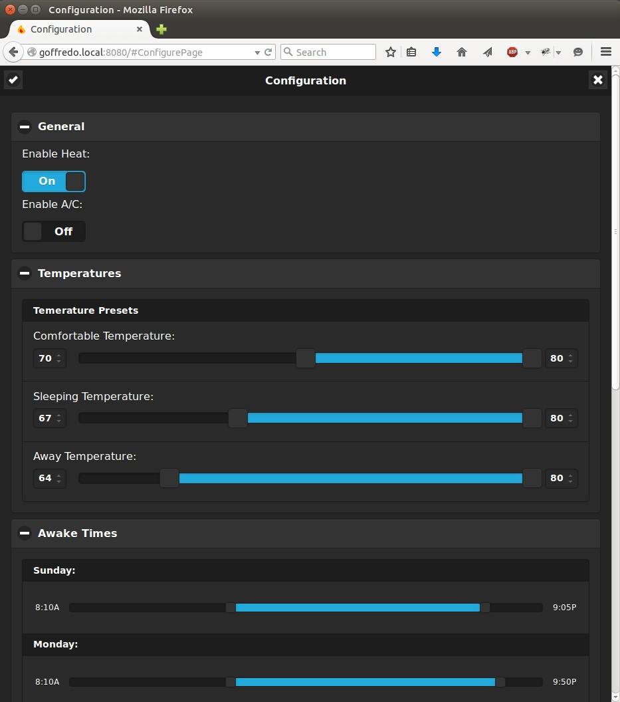

# Yun Thermostat

For full documentation visit [YunThermostat at rtfd](http://YunThermostat.rtfd.org).

## What is it?

YANATP, or Yet ANother Arduino Thermostat Project.

Why is this one different?

 * It uses Python
 * It uses Wifi
 * It doesn't use a database
 * It doesn't _require_ the Internet

## Story

Geez, I dunno, two of us got together and wanted to toy around with an Arduino
Thermostat, but we didn't find anything that detailed, or exactly what we
wanted. So we decided it'd be fun to write one from scratch.

## Screen shots

### From a Mobile Phone:

Image of the real-time graph (24 hour view) from the web page. 

### From a Computer (These pages are also available from a phone):

Image of the configuration page.

More of the configuration page.

Real time logging.

## Components

### The minimum hardware is:
1. A temperature sensor
1. A relay (the easiest is to find a premade relay "board" on amazon). Three for heat plus A/C.
1. An Arduino Yun

Additionally, we both happen to have a LCD display shield with buttons, so
that's also integrated.

### The software is:
1. The Arduino software (with support for the Yun)
1. Python
1. Bottle, a very light weight python web server
1. JQuery, JQuery Mobile, and Jquery Flot. Open source Java Script tools

### The cloud services in use are:
1. Thingspeak.com
1. Wunderground.com

## Project layout

    # Everything that goes onto the Linux side of the Yun
    linux/                      
        javascript/             # Where to put the javascript includes
        scripts/                # helper scripts for running automatically on the Yun
        static/                 # Any web items that are version controlled but don't ever
                                # change
        thermostat/             # The main python library for the thermostat
            email_utils.py      # Utilities to drive outgoing emails
            settings.py         # a settings store for the thermostat
            sseLogHandler.py    # python logging.Handler that supports sending logs
                                # to a live web page
            Thermostat.py       # The main logic for the python Thermostat
            Web.py              # Web interface (Bottle interface) for the thermostat.
        views/                  # Folder that contains templates for the bottle web interface.
            forms.tpl           # Javascript to handle the configuration page
            index.tpl           # The web interface html
            updater.tpl         # Javascript to handle updating the web interface with
                                # data from python.
        settings.json           # Storage for your settings (not committed to git).
        thermostatApp.py        # Main app to launch the thermostat.

    # Arduino files    
    Config.h        # Configuration for the Arduino.
    Control.h       # Temperature Control
    Display.h       # LCD & Keypad Control
    Sensor.h        # Temperature sensor interface
    thermostat.ino  # Main arduino sketch
    Util.h          # File to store misc. helping functions.
    Web.h           # Interface to the REST api from the arduino.

    # Documentation    
    mkdocs.yml      # The documentation configuration file.
    docs/           # Other markdown pages, images and other files.
        index.md    # This document.
    README.md       # links to RTFD.org
    LICENSE         # License
